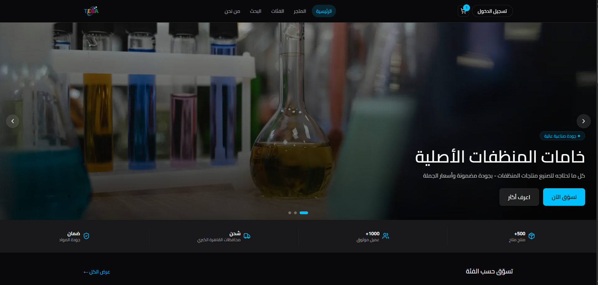

# 🚀 Teba — E-Commerce Web App

A modern, full-featured e-commerce platform built with Next.js 14, TypeScript, and a robust backend stack. Teba is designed for businesses seeking a customizable, scalable, and developer-friendly online store solution.


## 📸 Screenshots / Demo

<p align="center">
    
</p>


---

## 📖 Description

Teba is a production-ready e-commerce web application supporting a complete shopping experience: product catalog, cart, checkout, user accounts, and an admin dashboard. It leverages the latest Next.js features (App Router, server actions), integrates with PostgreSQL via Prisma ORM, and offers seamless authentication, media management, and real-time search.

---

## ✨ Features

- 🛒 Product catalog with categories, variants, and search (Algolia)
- 🛍️ Shopping cart and checkout with multiple payment methods (Instapay, Vodafone Cash, Pay on Delivery)
- 👤 User authentication (Google OAuth, Email/Password) and account management
- 🧑‍💼 Admin dashboard for managing products, orders, and analytics
- 📦 Order management and status tracking
- 🖼️ Image uploads via Cloudinary
- 🌙 Light/dark mode and RTL (Arabic) UI support
- 🔍 Instant search with Algolia
- 📱 Responsive, accessible, and modern UI (shadcn/ui, Tailwind CSS)
- 🗂️ Modular, scalable codebase with TypeScript and Zustand state management

---

## 🧰 Tech Stack

| Layer         | Technology                                 |
|---------------|--------------------------------------------|
| Framework     | Next.js 14 (App Router)                    |
| Language      | TypeScript                                 |
| Styling       | Tailwind CSS, shadcn/ui                    |
| Database      | PostgreSQL (Vercel Postgres / Neon)        |
| ORM           | Prisma                                     |
| Auth          | NextAuth.js v5 (Google, Email/Password)    |
| State         | Zustand                                    |
| Media         | Cloudinary                                 |
| Validation    | Zod                                        |
| Search        | Algolia                                    |
| Charts        | Recharts                                   |
| Deployment    | Vercel                                     |

---

## ⚙️ Installation

1. **Clone the repository**
     ```bash
     git clone https://github.com/your-org/teba.git
     cd teba
     ```

2. **Install dependencies**
     ```bash
     npm install
     ```

3. **Set up environment variables**

     >  create a `.env.local` file with the following (assumed) variables:_
     ```
        # Database URL
        DATABASE_URL=""

        # App
        NEXT_PUBLIC_APP_URL=""
        NEXT_PUBLIC_APP_NAME=""
        NODE_ENV=""

        # NextAuth
        AUTH_SECRET=""
        NEXTAUTH_URL=""

        # Google Auth
        AUTH_GOOGLE_ID=""
        AUTH_GOOGLE_SECRET=""

        # Facebook Auth
        AUTH_FACEBOOK_ID=""
        AUTH_FACEBOOK_SECRET=""

        #  Cloudinary
        CLOUDINARY_CLOUD_NAME=""
        CLOUDINARY_API_KEY=""
        CLOUDINARY_API_SECRET=""
        NEXT_PUBLIC_CLOUDINARY_CLOUD_NAME=""


        # Algolia
        NEXT_PUBLIC_ALGOLIA_APP_ID=""
        NEXT_PUBLIC_ALGOLIA_SEARCH_KEY=""
        NEXT_PUBLIC_ALGOLIA_INDEX_NAME=""
        ALGOLIA_ADMIN_KEY=""
     ```

4. **Set up the database**
     ```bash
     npx prisma migrate dev
     npx prisma db seed
     ```

5. **Run the development server**
     ```bash
     npm run dev
     ```
     Open [http://localhost:3000](http://localhost:3000) in your browser.

---

## ▶️ Usage

- **Development:**
    `npm run dev` — Start the Next.js development server.

- **Production build:**
    `npm run build` — Build the app for production.
    `npm start` — Start the production server.

- **Linting:**
    `npm run lint` — Run ESLint on the codebase.

- **Database:**
    Use Prisma CLI for migrations and seeding.

---

## 🗂️ Project Structure

```
teba/
├── app/                # Next.js App Router (pages, API routes)
│   ├── (auth)/         # Login, register
│   ├── (store)/        # Shop, product, cart, search
│   ├── (account)/      # Checkout, profile, orders
│   ├── (admin)/        # Admin dashboard
│   └── api/            # API routes (auth, upload, admin)
├── components/         # UI components (by domain)
├── hooks/              # Custom React hooks
├── lib/                # Auth, Prisma, Cloudinary, utilities
├── prisma/             # Prisma schema, migrations, seed
├── public/assets/      # Static files (images, etc.)
├── scripts/            # Utility scripts (e.g., Algolia sync)
├── store/              # Zustand stores (cart, UI)
├── types/              # TypeScript types/interfaces
├── tailwind.config.ts  # Tailwind CSS configuration
├── next.config.mjs     # Next.js configuration
└── package.json        # Project metadata and scripts
```

---

## 🔌 API Documentation

### Auth API

- `POST /api/auth/[...nextauth]`
    Handles authentication (Google, Facebook, credentials).

### Image Upload

- `POST /api/upload`
    Authenticated users can upload images to Cloudinary.
    **Body:** `{ image: string, folder?: "avatars" | "products" }`

### Admin Product Images

- `GET /api/admin/product-images`
    Admin-only. Validates product images.
- `POST /api/admin/product-images`
    Admin-only. `{ action: "fix-empty" }` to add placeholders to products missing images.

> _Additional endpoints may exist. See the `app/api/` directory for more._

---

## 📜 Scripts / Commands

| Script         | Description                        |
|----------------|------------------------------------|
| dev            | Start development server           |
| build          | Build for production               |
| start          | Start production server            |
| lint           | Run ESLint                         |
| prisma:seed    | Seed the database (via Prisma)     |

---

## 🔑 Environment Variables

_The following are required (assumed from code and integrations):_

- `DATABASE_URL` — PostgreSQL connection string
- `AUTH_GOOGLE_ID`, `AUTH_GOOGLE_SECRET` — Google OAuth
- `AUTH_FACEBOOK_ID`, `AUTH_FACEBOOK_SECRET` — Facebook OAuth (optional)
- `CLOUDINARY_CLOUD_NAME`, `CLOUDINARY_API_KEY`, `CLOUDINARY_API_SECRET` — Cloudinary
- `ALGOLIA_APP_ID`, `ALGOLIA_API_KEY` — Algolia search
- `NEXTAUTH_SECRET` — NextAuth.js secret


---

## 🤝 Contributing

Contributions are welcome! Please open issues or submit pull requests for improvements, bug fixes, or new features.

